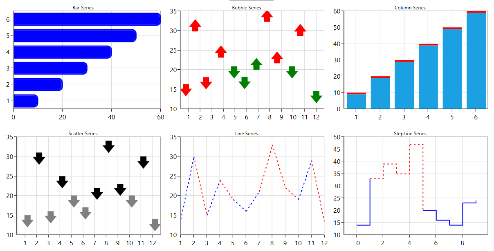

# How to customize the chart series in WPF SfChart
SfChart provides a perfect way to visualize data with a high level of user interactivity that focus on development,productivity and simplicity of use. SfChart also provides a wide variety of charting features that can be used to visualize large quantities of data, flexibility of binding data and user customization.
This example demonstrates how to customize the chart series in WPF platform using the data template.

For more details please refer the WPF UG documentation link for [series customization](https://help.syncfusion.com/wpf/sfchart/styling-and-customization#customize-series).

## Requirements to run the demo ##

* Minimum [Visual Studio 2017](https://visualstudio.microsoft.com/downloads/)

## Troubleshooting ##
### Path too long exception
If you are facing path too long exception when building this example project, close Visual Studio and rename the repository to short and build the project.

## Output ##

## See more

You can refer to our [WPF Charts](https://www.syncfusion.com/wpf-controls/charts?_gl=1*1m2hzo7*_ga*mziymta2oteumty4njazntewmg..*_ga_wc4jkkphh0*mty5mjmzmzyyms4ymzcums4xnjkymzmznjq0ljm3ljauma..*_ga_41j4hfmx1j*mty5mjmzmzyyms40ny4xlje2otizmzm2ndqumc4wlja.) feature tour page for its groundbreaking feature representations. You can also explore our [WPF Charts example](https://github.com/syncfusion/wpf-demos) to knows various chart types and how to easily configured with built-in support for creating stunning visual effects.
